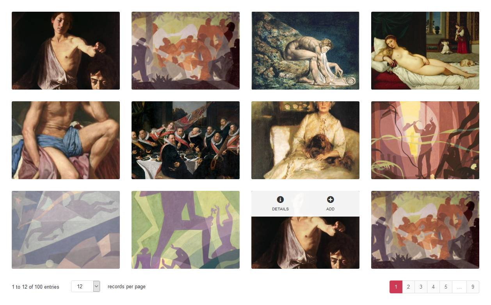

<!-- README.md is generated from README.Rmd. Please edit that file -->

```{r, include = FALSE}
knitr::opts_chunk$set(
  collapse = TRUE,
  comment = "#>",
  fig.path = "man/figures/README-",
  out.width = "100%"
)

options(width = "100")
```

# shinygallery 

[](https://www.tidyverse.org/lifecycle/#experimental)
[](https://travis-ci.org/stefanieschneider/shinygallery)
[](https://ci.appveyor.com/project/stefanieschneider/shinygallery)

## Overview

This R package creates image gallery widgets with pagination to show images based on file or URL paths. shinygallery is built on top of [jPages](https://github.com/luis-almeida/jPages) and [Bootstrap](https://getbootstrap.com/).

If `limits` is set in `options`, only images within the specified interval are rendered. This allows, e.g., to display further images only after a page change; the loading speed is thus improved.

## Installation

You can install the development version of shinygallery from [GitHub](https://github.com/stefanieschneider/shinygallery):

``` r
# install.packages("devtools")
devtools::install_github("stefanieschneider/shinygallery")
```

## Usage

```{r example, code = readLines("inst/examples/gallery.R")}
```

## Contributing

Please report issues, feature requests, and questions to the [GitHub issue tracker](https://github.com/stefanieschneider/shinygallery/issues). We have a [Contributor Code of Conduct](https://github.com/stefanieschneider/shinygallery/blob/master/CODE_OF_CONDUCT.md). By participating in shinygallery you agree to abide by its terms.
